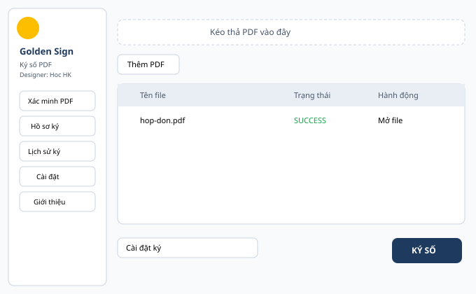
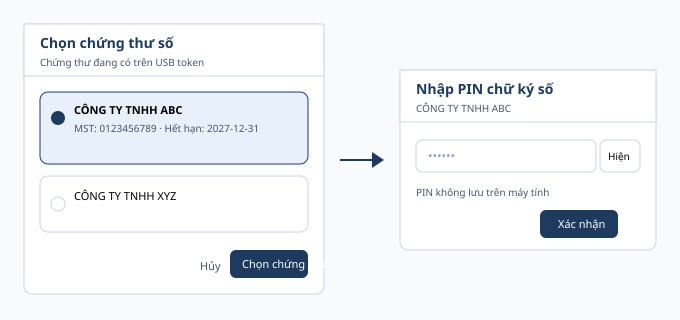

# Hướng dẫn sử dụng Golden Sign 1.0.0

Ứng dụng ký số PDF trên Windows (USB token / chữ ký số doanh nghiệp), ưu tiên quy trình **Hải quan (PUS)**.

> **Miễn trừ:** Ứng dụng phi lợi nhuận, không nhằm mục đích thương mại. Người dùng tự chịu trách nhiệm khi sử dụng để ký số file PDF. Liên hệ tư vấn thủ tục hải quan miễn phí — HOC HK (hochk2019@gmail.com · 0868.333.606).

---

## 1. Cài đặt

### Cách 1 — Installer (khuyến nghị)

1. Tải **`GoldenSign-Setup-1.0.0.exe`** từ [GitHub Releases](https://github.com/hochk2019/Golden-Signing/releases).
2. **Double-click** file Setup → làm theo wizard (tiếng Anh; không cần quyền admin).
3. Mặc định cài vào `%LOCALAPPDATA%\Programs\GoldenSign`.
4. Tạo shortcut **Desktop** và **Start Menu** (luôn có Desktop icon).
5. Mở **Golden Sign** từ Desktop.

### Cách 2 — Portable

1. Tải `GoldenSign-1.0.0-win64.zip`.
2. Giải nén ra thư mục bất kỳ.
3. Chạy **`GoldenSign.exe`** (chạy ngay, không cài), hoặc **`Cai-dat.bat`** nếu muốn cài vào máy.

### Gỡ cài đặt

*Settings → Apps → Golden Sign → Uninstall* (chuẩn Windows).

**Dữ liệu người dùng** (lịch sử ký, hồ sơ chứng thư, log):  
`%LOCALAPPDATA%\GoldenSign` — gỡ app **không** xóa thư mục này.

**Checksums:** đối chiếu SHA256 với `checksums.txt` trong Release nếu cần.

---

## 2. Giao diện chính

| Khu vực | Ý nghĩa |
|---|---|
| Thanh trái | Logo, tên app, điều hướng: Xác minh PDF · Hồ sơ ký · Lịch sử ký · Cài đặt · Giới thiệu |
| Kéo thả / Thêm PDF | Nạp file cần ký (hỗ trợ kéo-thả) |
| Bảng file | Tên file · Trạng thái · Hành động (Mở file / Mở thư mục / Xóa) |
| Thư mục output | Trống → thư mục `signed` cạnh file nguồn |
| **KÝ SỐ** | Bắt đầu ký toàn bộ danh sách |



---

## 3. Ký số PDF (USB token)

1. Cắm **USB token** (ví dụ ECA ePass2003) đã cài driver/CSP.
2. Thêm PDF (nút *Thêm PDF* / *Thêm thư mục* hoặc kéo thả).
3. Bấm **KÝ SỐ**.
4. **Chọn chứng thư số** trên token (thẻ doanh nghiệp / MST / hạn dùng) → *Chọn chứng thư*.
5. **Nhập PIN** token → *Xác nhận*.
6. Chờ từng file xong — file lỗi **không** làm hỏng cả batch.

Ký lại: *Ký lại lỗi*. Xem chi tiết lỗi: cột Hành động → *Chi tiết*.



---

## 4. Chữ ký hiển thị (Cài đặt ký)

Nút **Cài đặt ký**:

- **Chế độ:** *Hiển thị trên PDF* hoặc *Vô hình* (PUS Safe mặc định vô hình — app không tự bật visible).
- **Màu chữ, nền nhạt, logo** theo doanh nghiệp.
- **Vị trí:** bấm *Vị trí* → chọn trang, bấm lên preview (kể cả khi chưa thêm file — trang A4 mẫu).

Cài đặt **lưu theo chứng thư** (fingerprint) và theo app-wide default.

---

## 5. Cài đặt ứng dụng

| Mục | Ghi chú |
|---|---|
| Thư mục output mặc định | Áp dụng ngay khi Lưu |
| Chế độ ký / màu / nền | Mặc định cho lần ký sau |
| Tự quét USB token khi mở app | Bật/tắt; bật lại → quét ngay |
| Tự kiểm tra cập nhật khi mở app | Xem mục 6 |
| GitHub repo cập nhật | Mặc định `hochk2019/Golden-Signing` |

---

## 6. Cập nhật phiên bản

1. App dò GitHub Releases (~2 giây sau khi mở, nếu bật auto-check).
2. Có bản mới → hộp thoại: **phiên bản mới**, **ghi chú release**, nút *Cập nhật ngay* / *Để sau*.
3. *Cập nhật ngay* → tải zip → **kiểm SHA256** → thay thư mục cài → **mở lại app**.
4. Nếu hash không khớp → **không cài**.

Kiểm tra tay: **Giới thiệu → Kiểm tra cập nhật**.

Release cần kèm:

- `GoldenSign-Setup-<ver>.exe` (installer — cài mới)
- `GoldenSign-<ver>-win64.zip` (portable + **asset mà updater tải**)
- `checksums.txt` (`<sha256>  <tên file>` cho từng file)

---

## 7. Xác minh PDF

*Mục Xác minh PDF* — chọn file đã ký để kiểm tra chữ ký / cấu trúc (dùng trước khi gửi hồ sơ).

---

## 8. Lịch sử ký

*Lịch sử ký* — SQLite local (`%LOCALAPPDATA%\GoldenSign\history.db`).  
**Không** lưu PIN hay private key. Log app đã che PIN/key.

---

## 9. Xử lý lỗi thường gặp

| Hiện tượng | Xử lý |
|---|---|
| Không thấy token | Cắm lại USB · *Quét lại token* · cài driver CSP11 |
| Sai PIN | Token có thể khóa sau nhiều lần sai — theo hướng dẫn của CA |
| Không tải được bản cập nhật | Kiểm tra mạng / GitHub; có thể tải zip tay từ Releases |
| File PDF hỏng / có mật khẩu | App hỗ trợ PDF mã hóa “empty password”; PDF cần mật khẩu thật → mở bằng password trước |

---

## 10. Yêu cầu hệ thống

- Windows 10/11 64-bit  
- USB token + PKCS#11 (CSP) của nhà cung cấp chữ ký số  
- Mạng (chỉ khi check/update)

---

## 11. Phát triển / build

Xem `README.md`.

```
packaging\build_release.ps1
```

Output trong `dist\release\`:

- `GoldenSign-Setup-<ver>.exe` — Inno Setup installer  
- `GoldenSign-<ver>-win64.zip` — portable  
- `checksums.txt`  

Yêu cầu build: Python 3.13 + venv dự án, PyInstaller, Inno Setup 6 (`ISCC.exe`).

Developer: **HOC HK** — hochk2019@gmail.com — 0868.333.606  
Sản phẩm của **Golden Logistics**.
